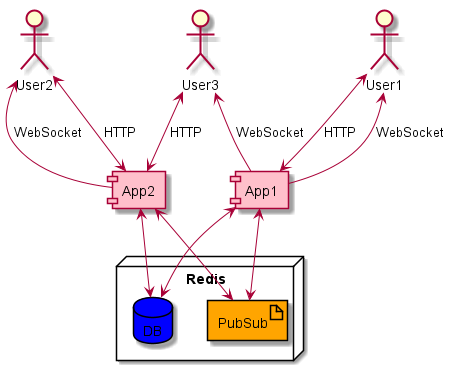

# Messaging App

This application allows users to post messages and view messages from all users.

Multiple instances of this app can be deployed simultaneously.

## Deployment Diagram

## Getting Started

### Build

Build:

> mvn clean install

Note, if you do not have maven installed, you can use the included maven wrapper and run with mvnw.

### Standalone Local Deployment

Note, you will need a local instance of Redis running on port 6379.

Run:

> mvn spring-boot:run

To start multiple instances on different ports run:

> mvn -Dserver.port=8081 spring-boot:run (or mvn -D"server.port"=8081 spring-boot:run)

### Multi-Instance Deployment Using Docker

Run:

> docker-compose up

This starts Redis and 3 instances of the application.

### Multi-Instance Deployment Using Play With Docker

Note, this is how the Docker setup was tested for this application.

1. Create a GitHub repo containing the files Dockerfile, docker-compose.yml and target/messaging-<version>.jar from this project.
2. Go to [Play With Docker](https://labs.play-with-docker.com) and click Start and then Create Instance.
3. Run:
   > apk add git --no-cache
4. Run:
   > git clone <HTTP/SSH link>
5. Run:
   > docker-compose up

This starts Redis and 3 instance of the application. You can access the HTML pages for each instance via the links displayed within Play With Docker.

### Play With It

Demo page that allows a user to send messages and view their own and other users' messages. After opening the page be sure to press "Connect"!

For a local deployment use the following URL, replacing the port number as appropriate:

> [http://localhost:8080/](http://localhost:8080/)

There is also a Swagger interface for conveniently executing HTTP endpoints. For a local deployment use the following URL, replacing the port number as appropriate:

> [http://localhost:8080/swagger-ui.html](http://localhost:8080/swagger-ui.html)

